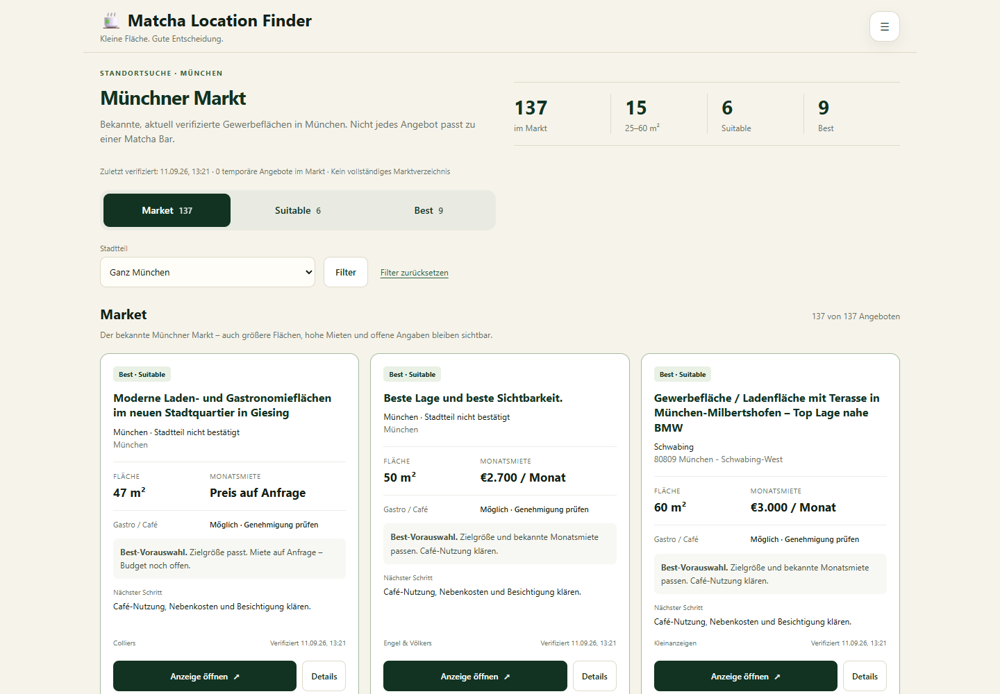
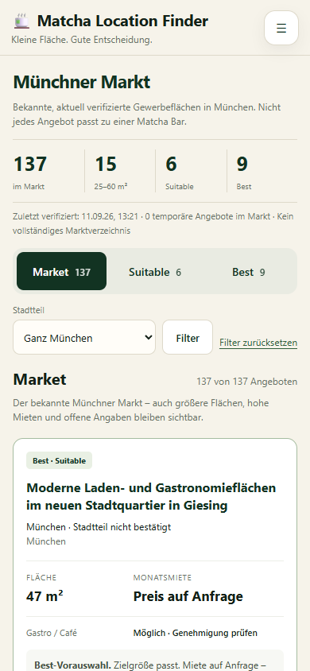

# Phase 3C.4 — Market / Suitable / Best UI

Base: `af58775283fb1233e57b72877990e33669106293` (Phase 3C.3 merged).
Branch: `codex/phase3c4-market-ui`.

## Audit and implementation plan

The existing static frontend used `js/app.js`, `js/filters.js`, `js/listings.js`,
the Supabase mapper/repository and one stylesheet. Its default Best/source tabs
all passed through a restrictive visibility predicate before rendering; they
could not expose broad Market inventory. Duplicated summary counts, a combined
Best/leads count, a placeholder map and duplicate mobile navigation obscured
coverage. Cards used large evidence blocks, with no physical-district filter.
Phase 3C.2/3 diagnostics existed in backend reports, but not in frontend state.

The pre-edit plan was to retain this app and its details/manual notes, reuse
the existing backend classifications through a deterministic browser package,
add counted inventory tabs and dynamic physical-district/combined filters,
replace the main cards and summary, and verify desktop/mobile behavior.

## Result

- Market is the default. Tabs switch immediately, with counts that reconcile to
  rendered cards after filters; the summary retains the full dataset totals.
- Large, expensive and uncertain listings remain visible in unfiltered Market.
  Cards show Suitable exclusions, explicit uncertainty/prohibition, source and
  verification time, with a direct listing action and useful details.
- Trusted price-on-request stays visibly unconfirmed as a budget. Explicit null
  rent no longer falls back to the legacy `price` column.
- District choices are built from the current inventory's extracted location
  evidence. Search hints and bare legacy district labels cannot supply physical
  locations. Unspecified Munich is a separate choice; no geocoding is invented.
- Temporary inventory is labelled `Temporär · Pop-up`, sorted after other units,
  and its details explicitly distinguish it from a confirmed long-term lease.
- The placeholder map and generic source/list-map tabs were removed. Manual
  notes/leads remain separately accessible and never enter inventory counts.
- Loading failures display an error/retry state, not sample or stale fallback
  listings. No notification, contact or map functionality is fabricated.

## Classification contract

`scripts/build-ui-policy.js` packages the **unchanged** backend policy modules
into `js/generated/market-policy.js`. It performs no discovery or network access.
Regenerate with `node scripts/build-ui-policy.js`; CI checks for drift with
`--check`. The small module loader uses static factories, not eval. Unreachable
discovery hashing fails closed in the browser.

Market and Suitable use `classifyMarketListing` directly. Best uses its existing
`isVisibleCandidate` result plus the frontend's existing 48-hour freshness gate
and a usable HTTP(S) link. Backend scoring, budgets, business fit and source
allowlists are not rewritten in frontend code. The old browser-only policy had
drifted from ingestion; current tabs consume canonical backend behavior. Best
and Suitable remain independent classifications, so Best can exceed Suitable.
No rules are relaxed to make the groups artificially nested.

## Data observed during live verification

Read-only inspection on **11 September 2026, 14:10 Europe/Berlin**; latest
verification shown by the dataset was 13:21 that day. See the aggregate
[validation snapshot](phase3c4-validation.json).

| Source | Market | Suitable | Best |
|---|---:|---:|---:|
| Kleinanzeigen | 45 | 4 | 7 |
| Engel & Völkers | 44 | 1 | 1 |
| Colliers | 44 | 1 | 1 |
| immobilie1 | 4 | 0 | 0 |
| **Total** | **137** | **6** | **9** |

The API returned 217 rows including older/non-inventory records. Current Market
contains **15 units of 25–60 m²**, **0 marked temporary** and **83 without a
confirmed named district**. Three older rows pass Best's parameter gates but
fail the retained 48-hour freshness requirement (12 before freshness, 9 after).

The saved Phase 3C.3 dry-run report is a different dataset: 154 rows, Market 125,
Suitable 6, Best 9, 20 target-size Market units and four temporary units. Its
135 verified-direct count is broader than its 125 Market count. Tests reproduce
these report counts after serialization/mapping, at the report's timestamp.
The production UI does not import this report or its additional temporary units.
No production sync was performed to change what the dashboard shows.

The district filter uses existing reporting district groups, not geocoded
official boundaries. For example, a title mentioning Giesing with only a generic
Munich location remains unspecified. No facts are inferred from titles or queries.
Counts will change with normal dataset refresh and expiry. Numeric filters
exclude unknown/unusable values rather than treating them as zero.

## Validation

All passed locally:

- `node scripts/tests/market-ui.test.js`: generated policy/source parity across
  all 154 report rows and edge cases, backend Best parity, report-to-database
  mapper reconciliation, counts, filtering/reset, safe external URLs and cards.
- `node scripts/tests/market-ui.browser.test.js`: isolated browser regression at
  1440×1000 and 390×844. Tabs/counts, keyboard navigation, combined filters,
  confirmed Laim vs Pasing hint, unknown rent/area, prohibited gastro, temporary
  details, long German titles, touch targets, external popup and error/retry.
  Test-only responses are isolated; no external data calls/writes occur.
- Existing ingestion tests (including small-unit regressions), Phase 3B
  extraction tests and validation-report reconciliation tests.
- `node --check` on every JS file under `js/` and `scripts/tests/`, plus the policy
  build script; `git diff --check`.
- Live Edge/Chromium inspection at both widths: no horizontal overflow in the
  inventory, details or filter sheet; readable wrapping and usable tabs/controls.
  The primary Colliers action opened the matching real source page. Zero uncaught
  browser errors and zero Supabase write requests were observed.

Browser tests require Playwright (`PLAYWRIGHT_MODULE_PATH` can point to an existing
installation; `BROWSER_CHANNEL=msedge` was used locally). The new CI workflow
installs pinned Playwright/Chromium and runs offline UI tests and existing smoke
tests with read-only repository permissions. CI execution on GitHub is separate
from the completed local checks.

This frontend phase did not rerun discovery or mutate the saved ingestion report.
It validated that existing report and exercised the live read-only frontend.
No ingestion/search code, Best gates, Supabase schema/configuration, production
data or notifications were changed. The PR is for review; no merge is performed.

## Screenshots of actual live data

## Changed files

- UI: `index.html`, `css/styles.css`, `js/app.js`, `js/inventory.js`,
  `js/decision-cards.js`, `js/data/listings-mapper.js`, `js/data/listings-repository.js`.
- Shared policy package: `scripts/build-ui-policy.js`, `js/generated/market-policy.js`.
- Checks: `.github/workflows/market-ui.yml`, `scripts/tests/ui-fixtures.js`,
  `scripts/tests/market-ui.test.js`, `scripts/tests/market-ui.browser.test.js`.
- Evidence: `docs/phase3c4.md`, `docs/phase3c4-validation.json`,
  `docs/screenshots/phase3c4-desktop.png`, `docs/screenshots/phase3c4-mobile.png`.
